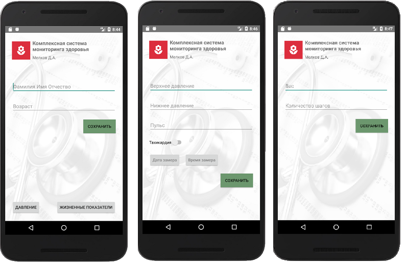

## Комплексное приложение для мониторинга здоровья
** Условия задачи: **
https://github.com/netology-code/and-homeworks/tree/master/1.3.interface%26debug/1.3.1

### Требуется реализовать 3 экрана приложения:
1. Стартовый экран, на нём:

- Вверху экрана разместить картинку – иконку приложения, рядом с ней расположить название приложения «Комплексная система мониторинга здоровья» и фамилию автора.
- Ниже нужно расположить согласно правилам эргономики поля для ввода ФИО и возраста пациента.
- Ещё ниже нужно разместить кнопку «Сохранить». При нажатии на кнопку Сохранить программа должна считать данные из формы и записать в поля внутренней структуры, проверив, при необходимости, введенные данные.
- Ниже на форме расположить панель навигации – две кнопки. При нажатии на первую – переход на экран записи показателей давления, вторая – переход на экран записи жизненных показателей здоровья.

2. Экран записи давления – нужно реализовать форму для записи показаний давления:

- После считывания показателей, нужно сохранить их во внутреннюю структуру данных.
- На экран добавить элементы управления для ввода значений (описание класса ниже) и кнопку Сохранить. При сохранении надо добавлять новое значение в коллекцию значений в текущей Activity.

3. Экран записи жизненных показателей:

- После считывания показателей, нужно сохранить их во внутреннюю структуру данных.
- На экран добавить элементы управления для ввода значений (описание класса ниже) и кнопку Сохранить. При сохранении надо добавлять новое значение в коллекцию значений в текущей Activity.
- Для каждого экрана нужно организовать собственную структуру данных – отдельный класс.

** Для стартового экрана – класс с полями : **

- ФИО – строка
- Возраст – целое число
- Для экрана записи давления – коллекцию с показаниями (тоже свой класс).

Выберите самостоятельно подходящую коллекцию для хранения списка значений класса Индивидуальных показателей.

** Класс индивидуальных показателей: **

- Верхнее давление – целое число;
- Нижнее давление – целое число;
- Пульс – целое число;
- Тахикардия – флаг да или нет;
- Дата замера – дата и время.
- Для экрана записи жизненных показателей – аналогично коллекцию для хранения списка значений.

** Класс жизненных показателей: **

- Вес – дробное число;
- Количество шагов – целое число.

